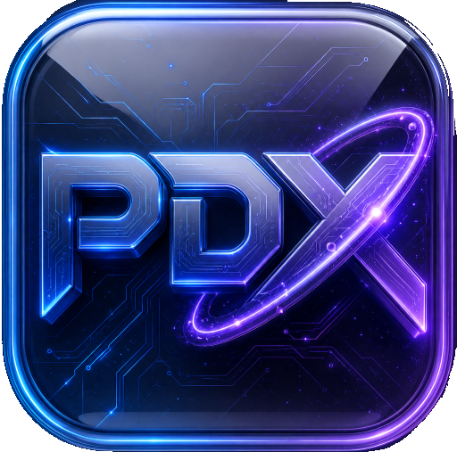

# ProtonDesk-X

<p align="center">
  
</p>

<p align="center">Unofficial LINUX desktop app for Proton services</p>

<p align="center">
  
</p>


## About

**ProtonDesk-X** is a free open‑source desktop app for Proton services. It brings together Proton Mail, Proton Calendar, Proton Drive, Proton Docs, Proton Pass, Proton Wallet, Proton LumoAI, Proton Meet into a single Linux application.


## Features

- **Single web view** – the app loads Proton Mail directly.
- **Session persistence** – session data is stored on disk.
- **File downloads** – attachments from Proton Mail can be downloaded.
- **Open‑source** – the source code is available for inspection.


## Download

Only Linux is supported (.AppImage). The AppImage can be downloaded from the releases page.

<p align="center">
  <a href="https://github.com/artfix/ProtonDesk-X/releases">
    
  </a>
</p>


## Contributions

We welcome contributions. Fork the repository, create a branch, make changes, commit with a clear message and open a PR.


## Packaging & Distribution

The app is built as an AppImage on Linux. The CI workflow in `.github/workflows/cd.yml` runs on every push to `main` , `release.yaml` build all and upload to git.

To build locally:

```bash
pip install -r requirements.txt
pyinstaller --onefile app.py
```

The compiled file will be in the `dist` folder.


## Developers & Maintainers

ArtFix – [artfix@protonmail.com](mailto:artfix@protonmail.com)
